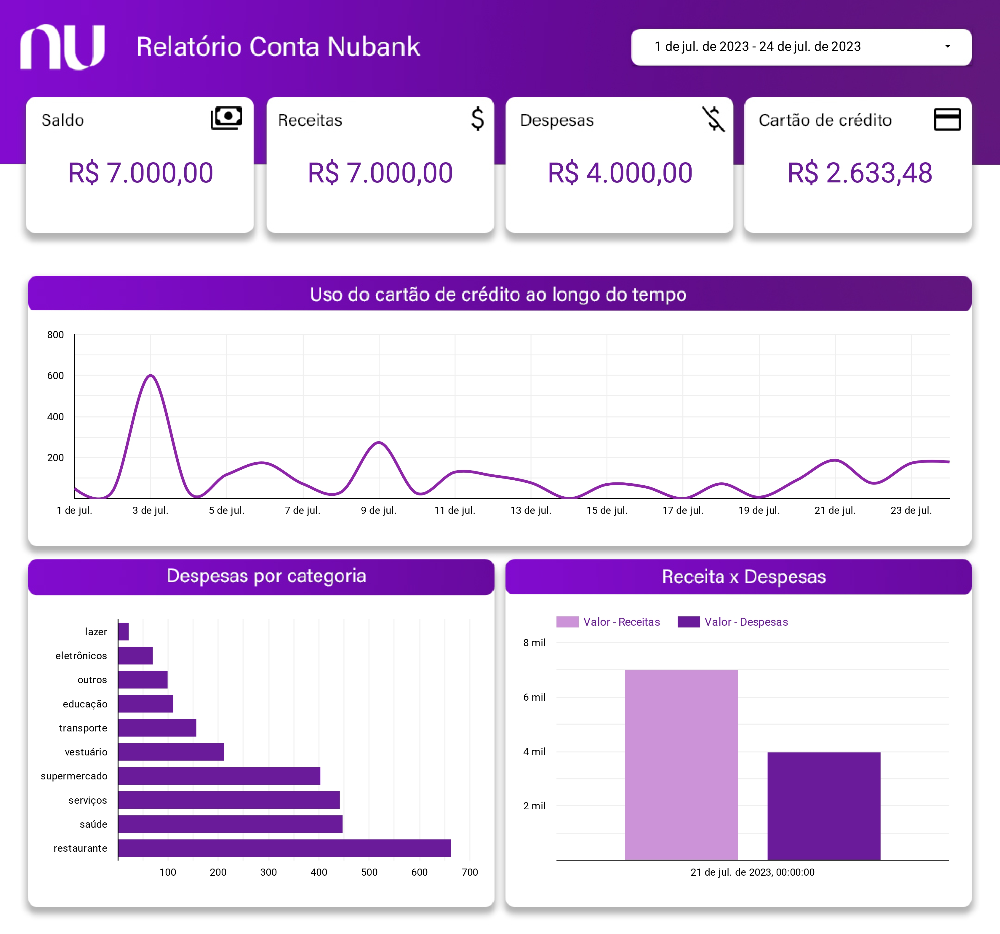

# Nubank
> ###### Autor: Marcos Alexandre
> ###### Data: Julho 29, 2023
## Descrição
Este projeto tem como objetivo automatizar a coleta, análise e visualização dos dados da conta Nubank por meio de uma arquitetura de engenharia de dados provisionada na nuvem AWS (Amazon Web Services). A solução oferece uma visão detalhada das transações, despesas, receitas, saldo da conta e limites de crédito, permitindo um gerenciamento financeiro mais eficiente e consciente.

## Fluxo 

1. **Coleta de Dados da Conta do Nubank:** 
Através de uma integração com a API do Nubank, os dados financeiros, incluindo transações, saldo da conta, limites de crédito e movimentações, são coletados de forma automatizada e segura.

2. **Armazenamento na Nuvem AWS:** 
Os dados coletados são armazenados no serviço de armazenamento S3 da AWS, garantindo a segurança, escalabilidade e disponibilidade necessárias para o projeto.    

3. **Pré-processamento e Limpeza de Dados:** Utilizando o PySpark, o projeto realiza transformações nos dados coletados, garantindo que eles estejam formatados corretamente para a análise.

4. **Análise e Classificação de Transações:**
 O projeto categoriza as transações de acordo com seus tipos, como compras, parcelamentos e receitas. Isso permite uma análise detalhada do uso do cartão de crédito ao longo do mês.

5. **Geração de Tabelas e Relatórios:** 
Os dados processados são organizados em tabelas e salvas no formato Parquet. Essas tabelas podem ser utilizadas para gerar relatórios detalhados sobre as despesas, receitas, saldo e limites de crédito.

6. **Integração com o Google Sheets e Data Studio:** 
Os dados são enviados para o Google Sheets e o Data Studio para uma visualização interativa e personalizada dos insights obtidos. Isso permite um acompanhamento mais dinâmico e uma melhor compreensão da gestão financeira.

7. **Notificações por E-mail:**
 O projeto envia notificações via e-mail para informar o início e conclusão do processamento dos dados, me mantendo informado sobre o status do fluxo de processamento.

## Ganhos com o projeto:

- **Automatização Financeira:**
 A automatização da coleta e análise de dados me permite ter uma visão completa e atualizada das minhas finanças, eliminando a necessidade de acompanhamento manual e trabalhoso.

- **Melhoria na Gestão Financeira:** 
Com os insights detalhados obtidos a partir da análise dos dados, posso tomar decisões financeiras mais conscientes, otimizando meus gastos e aumentando o controle sobre minhas finanças.

- **Comparação de Períodos:** 
O armazenamento dos dados em formato Parquet possibilita a comparação entre diferentes períodos de tempo, permitindo identificar tendências e mudanças no comportamento financeiro ao longo do tempo.

## Dashboard
- <a href="https://lookerstudio.google.com/reporting/10caac1c-251e-4a69-92ba-cd85e57aa33c" target="_blank">Visualizar no DataStudio</a>

> ###### Os dados apresentados no Dashboad são fictício

## Arquitetura dos dados

- [Detalhe sobre os serviços utilizados](./Infra/README.MD)

## Scripts
>[Extraindo os dados da Nubank via API](./Scripts/Extraindo_dados_Nubank_API.ipynb)

>[Limpando e transformando os dados](./Scripts/Transformando_os_dados.ipynb)

>[Coletando os dados do Athena e enviando para o Google Sheets](./Scripts/Coletando_dados_Athena_enviando_Google_Sheets.ipynb)

- [Detalhes sobre as depêndencias](./Scripts/README.MD)

