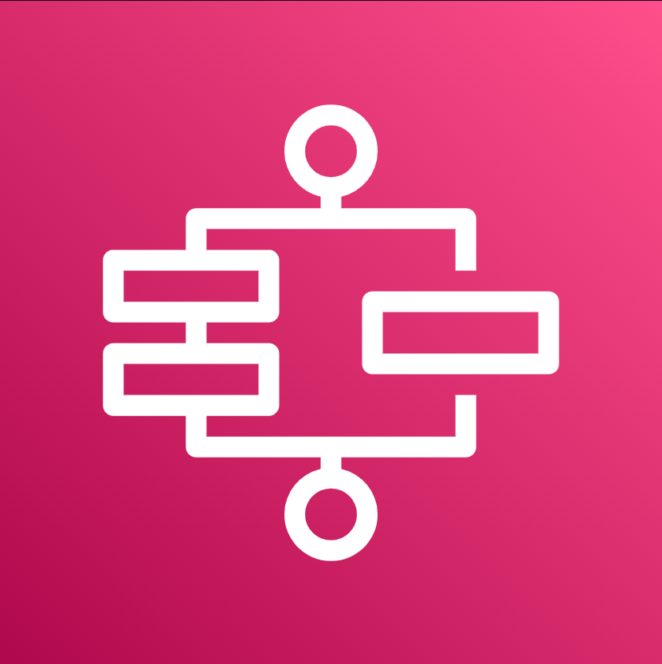
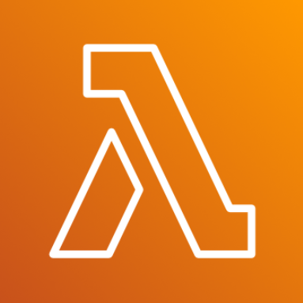
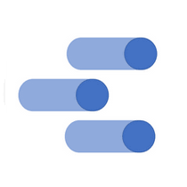
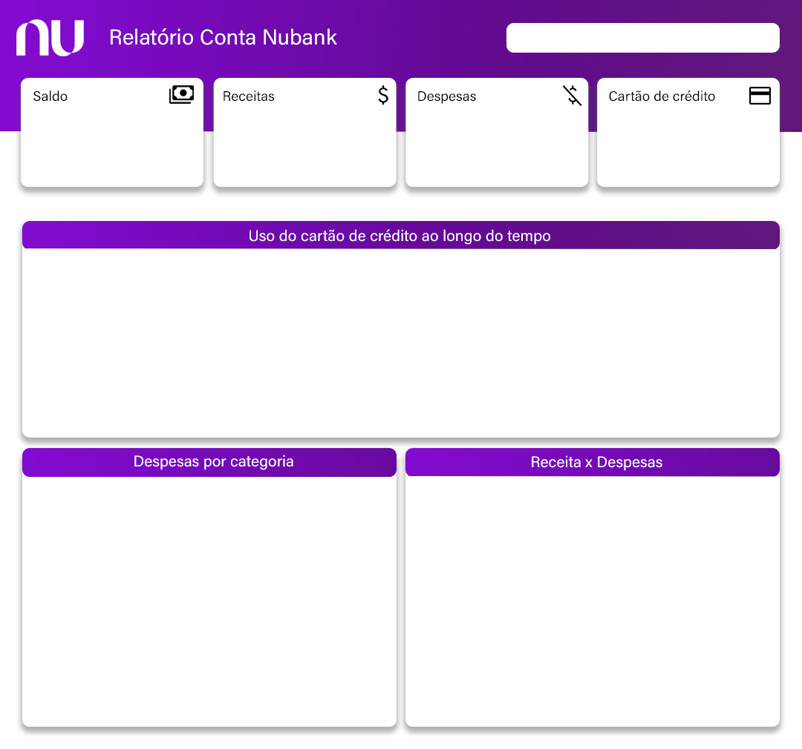
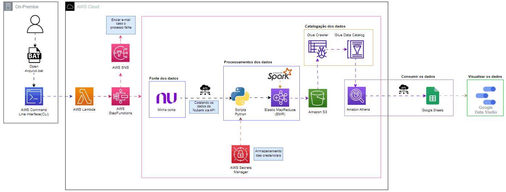

# Nubank

## Introdução

## Dependências

## Pré-requisitos

## Serviços e Recursos

| Icon| Serviços | Descrição |
|------|----------|-----------|
|| Athena (AWS)| Serviço de análise interativo e sem servidor com suporte a formatos de tabela e arquivo abertos.|
| | EMR (AWS)|            |
| |Glue Crawlers (AWS)|            |
| |Glue Data Catalog (AWS)|            |
| |SNS (AWS)|            |
| |Step Functions (AWS)|            |
||Command Line Interface (AWS)|            |
||Lambda (AWS)|            |
||Secrets Manager (AWS)|            |
||S3 (Google)|            |
||Google Sheets (Google)|            |
||DataStudio (AWS)|            |

## Dashboard

## Arquitetura

